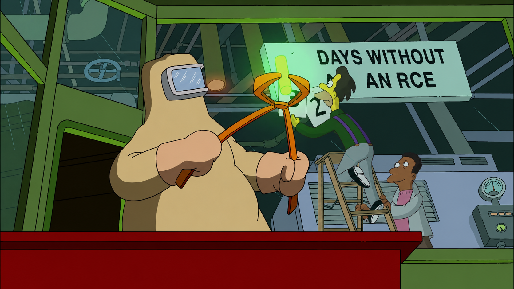
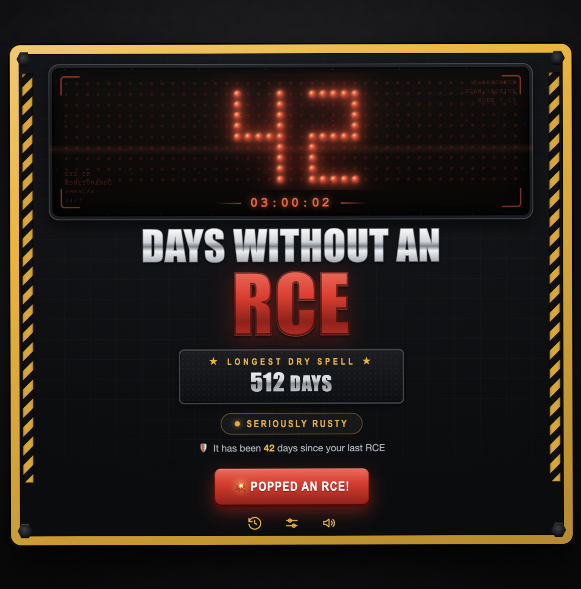
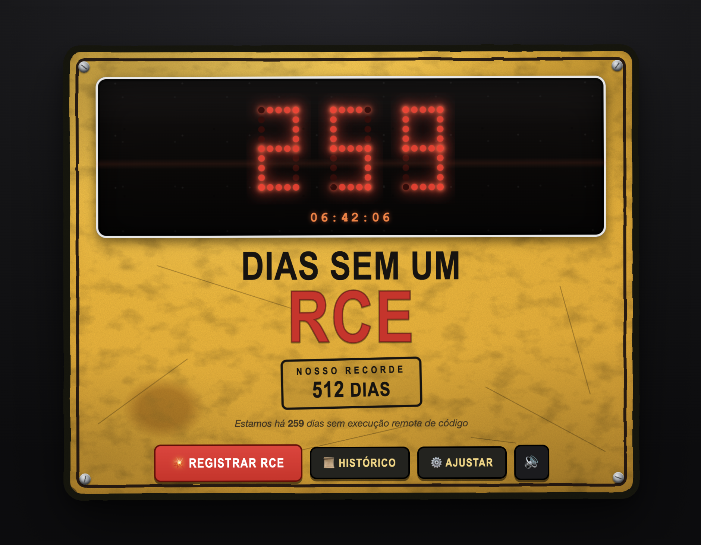

# 🟥 DWARCE — Days Without An RCE




A parody of those industrial safety signs — *"We've gone ___ days without a workplace
accident, our record is ___ days"* — but **with the moral flipped**: it counts the
**days without an RCE** (Remote Code Execution).

On a factory sign, many days **without an accident** is good. Here it's the **opposite**:
the longer you go **without popping an RCE**, the more **rusty** you are (*"not a hacker
anymore?"* 💀). Sitting at **0 days** means you just popped one = 🔥 **sinister**. Getting an
RCE is a **celebration** (confetti + fanfare), not an alarm.

A desktop app (Electron) styled like a dark tactical HUD: an **LED dot-matrix display** with
targeting-reticle overlays, framed by a **yellow industrial hazard bezel**, a chrome + glossy-red
title, a live counter, a roast verdict, a "longest dry spell" record, an RCE log, two languages
(EN / PT-BR) and local persistence.





## Download

Grab a prebuilt binary from the [**Releases**](https://github.com/thezakman/DWARCE/releases/latest)
page — no Node/Electron needed. Assets are `.tar.xz` (LZMA-compressed, ~60–75 MB):

| OS | Asset |
| --- | --- |
| **macOS** (Apple Silicon / Intel) | `DWARCE-<version>-macos-arm64.tar.xz` / `-macos-x64.tar.xz` |
| **Windows** (x64) | `DWARCE-<version>-win-x64.tar.xz` |
| **Linux** (x64) | `DWARCE-<version>-linux-x64.tar.xz` |

Extract, then run the app inside:

- **macOS** — double-click to extract (or `tar xf DWARCE-*.tar.xz`), then right-click `DWARCE.app`
  ▸ *Open* (unsigned build; or `xattr -dr com.apple.quarantine DWARCE.app`).
- **Windows** — `tar -xf DWARCE-*.tar.xz` (built into Win 10/11) or 7-Zip, then run `DWARCE.exe`
  (*More info ▸ Run anyway* on SmartScreen).
- **Linux** — `tar xf DWARCE-*.tar.xz && ./DWARCE-linux-x64/DWARCE`.

> Why `.tar.xz` and not a small `.exe`? Electron bundles a full Chromium runtime, so ~100 MB is
> unavoidable; LZMA trims it to ~65 MB. For a truly tiny binary the shell would need a lighter
> runtime (e.g. Tauri).

## Run from source

```bash
npm install   # pulls Electron
npm start
```

Already installed once? Just `npm start`.

## Features

- 🎯 **Multiple foci (topics)** — RCE is just the default. Pick what *you* chase: domain owned,
  admin cracked, vulnerability, 0day, shell, bounty, root, XSS, CVE, CTF first blood/flag, creds,
  vacation 🏖️ (the burnout meter) and the inside-joke **shooting star** 🌠 — **15 built-in**, each
  with its **own independent** dry spell, record and log. Switch anytime from the topic chip on the
  sign or the layers icon. Long names auto-shrink so they never overflow the frame.
- ➕ **Custom topics** — invent your own (emoji + name in EN/PT + article), pick its **type**, and
  it's saved to your board. Edit or delete later.
- 😩 **Two polarities** — *achievement* topics (RCE, 0day…) where 0 days = 🔥 sinister and going
  long = rusty; and *grind* topics like **shooting star** (last-minute fire drills) where the moral
  flips: many days **without** one = blissful peace, and catching one is comedic pain.
- ⏱️ **Rust meter** — days since your last hit, ticking up on its own in real time, plus a live
  `HH:MM:SS` clock.
- 💀 **Verdict** that shifts with your streak — `sinister` (0 days) → `still sharp` → `getting
  rusty` → `not a hacker anymore?` — shown as a color-coded status pill (inverted for grind topics).
- 💥 **Register a hit!** — celebration (confetti + fanfare + gold flash), resets the meter and logs
  it (optional note: CVE / target / service). Grind topics flip the FX: **rising flames** 🔥, a red
  panel flare and a "sad trombone" — because catching one means *everything's on fire*.
- 🏜️ **Longest dry spell** — the record (inverted!): the most days you ever went without one
  (or longest *peace streak* for grind topics).
- 🏆 **Log** — every hit you registered (date/time + the streak it broke + note), per topic.
- ⚙️ **Adjust** — seed/fix the values by hand and **switch language EN ↔ PT-BR**.
- 🔊 Toggleable sound (WebAudio, no asset files).
- 🎨 Handcrafted visuals: dark carbon/circuit substrate, yellow hazard frame with hex bolts,
  true LED dot-matrix panel (digits are lit cells of the same grid), HUD tech-text, chrome and
  glossy-red 3D lettering, and a responsive layout that scales to fit any window size.

## Persistence

State lives in `rce-board.json` inside Electron's per-user data folder
(`app.getPath('userData')`), so it survives updates and is never committed. It holds one board
**per topic** (`{ incidentDate, recordDays, history }`), the active topic, and any custom topic
definitions. It's generated on first run, every write is atomic (writes to `.tmp`, then renames),
and old single-topic saves are **migrated automatically** on load. Use **📁 Data** (inside
*Adjust*) to reveal the file.

## Security

`contextIsolation: true`, `nodeIntegration: false`, `sandbox: true` and a strict CSP — an app
about RCE couldn't have an RCE. 😏

## Structure

```
main.js            main process (window + IPC)
store.js           multi-topic state + persistence + migration (unit-testable in isolation)
store.test.js      unit tests (node --test store.test.js) — migration, CRUD, per-topic ops
preload.js         safe bridge (contextBridge)
renderer/
  index.html       board markup + modals (incident / adjust / log / topics picker)
  styles.css       all the visuals (dark HUD + LED dot-matrix + picker/form)
  segments.js      LED dot-matrix renderer (digits are lit cells of a shared grid)
  topics.js        15 built-in topics + text derivation (headline/verdict by polarity)
  renderer.js      UI, per-second tick, animations, i18n, topic switching, responsive scaling
```

## Tests

```bash
node --test store.test.js
```

Covers the multi-topic model: legacy→multi-topic migration (preserving your data), lazy per-topic
init, custom-topic CRUD, and that incidents/edits only touch the active topic.

## Build binaries

Packages standalone apps for all three platforms, prunes unused Chromium locales (keeps EN/PT-BR)
and LZMA-compresses each into `dist/*.tar.xz`:

```bash
npm run dist          # macOS (arm64+x64) + Windows (x64) + Linux (x64)
```

Building Windows/Linux from macOS works out of the box (no Wine/Docker) — `@electron/packager`
just fetches prebuilt Electron binaries. Requires `tar` and `xz` on the PATH.

## License

MIT
